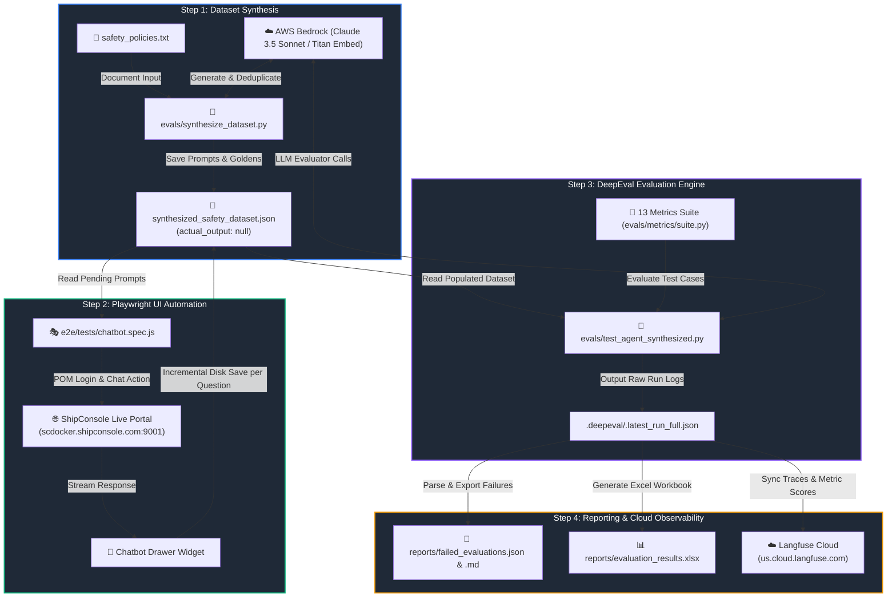

# 🔄 ShipConsole AI Chatbot - End-to-End Project Flow

This document provides a comprehensive overview of the execution flow, architecture, component interaction, and reporting mechanisms in the **ShipConsole AI Chatbot E2E UI Automation & DeepEval Evaluation Suite**.

---

## 📌 Executive Architecture & Data Flow



---

## 🚀 Detailed Phase-by-Phase Technical Flow

### 1️⃣ Step 1: DeepEval Dataset Synthesizer (`evals/synthesize_dataset.py`)

* **Primary Purpose**: Automatically extracts knowledge nodes and policy guidelines from raw policy documents to synthesize unique input prompts and expected ground-truth answers (goldens).
* **Source Document**: [safety_policies.txt](file:///d:/OneDrive%20-%20Shipconsole%20Private%20Limited/Desktop/Projects/Deepeval_Playwright/deepeval-agent-demo/evals/datasets/safety_policies.txt)
* **Target Output**: [synthesized_safety_dataset.json](file:///d:/OneDrive%20-%20Shipconsole%20Private%20Limited/Desktop/Projects/Deepeval_Playwright/deepeval-agent-demo/evals/datasets/synthesized_safety_dataset.json)
* **Execution Logic**:
  1. Loads existing JSON dataset from disk to construct a lowercased deduplication lookup set of all existing `input` prompts.
  2. Initializes AWS Bedrock LLM (`ChatBedrockConverse`) and Embedding Model (`amazon.titan-embed-text-v1`) using custom Bedrock drivers in [deepeval_bedrock.py](file:///d:/OneDrive%20-%20Shipconsole%20Private%20Limited/Desktop/Projects/Deepeval_Playwright/deepeval-agent-demo/evals/shared/deepeval_bedrock.py).
  3. Synthesizes `goldens` (input prompt + expected output) using DeepEval's `Synthesizer`.
  4. Filters out duplicate questions and appends new items to the JSON dataset with `"actual_output": null`.

---

### 2️⃣ Step 2: Playwright UI Automation (`e2e/tests/chatbot.spec.js`)

* **Primary Purpose**: Automates real browser interactions on the ShipConsole live web application to send synthesized prompts to the live chatbot and record streaming UI responses.
* **Page Object Models**:
  * [LoginPage.js](file:///d:/OneDrive%20-%20Shipconsole%20Private%20Limited/Desktop/Projects/Deepeval_Playwright/deepeval-agent-demo/e2e/pages/LoginPage.js) — Handles user authentication, navigation, and page load verification.
  * [ChatbotWidget.js](file:///d:/OneDrive%20-%20Shipconsole%20Private%20Limited/Desktop/Projects/Deepeval_Playwright/deepeval-agent-demo/e2e/pages/ChatbotWidget.js) — Opens the chatbot drawer, submits inputs, and polls response DOM bubbles until streaming completes.
* **Execution Logic**:
  1. Reads `synthesized_safety_dataset.json` from disk.
  2. Filters pending items (`actual_output` is missing or empty). If all items are populated, UI execution skips cleanly.
  3. Launches Playwright browser instance, logs in to `http://scdocker.shipconsole.com:9001/`, and opens the chatbot drawer widget.
  4. Iterates through pending prompts sequentially:
     * Submits prompt via chat input box.
     * Polls UI until the response stream terminates.
     * Captures the response text and assigns it to `item.actual_output`.
     * **Incremental Save**: Writes the updated dataset JSON directly to disk immediately after each question to ensure zero data loss on failure or network interruption.

---

### 3️⃣ Step 3: DeepEval Multi-Metric Evaluation Engine (`evals/test_agent_synthesized.py`)

* **Primary Purpose**: Evaluates the live chatbot responses (`actual_output`) against input prompts, expected goldens, and corporate compliance policies across **13 domain metrics**.
* **Metrics Suite**: Defined centrally in [suite.py](file:///d:/OneDrive%20-%20Shipconsole%20Private%20Limited/Desktop/Projects/Deepeval_Playwright/deepeval-agent-demo/evals/metrics/suite.py):
  1. **Answer Relevancy** (`threshold=0.7`): Verifies response directly addresses the question.
  2. **Faithfulness** (`threshold=0.7`): Ensures response aligns with reference ground truth.
  3. **Hallucination** (`threshold=0.3`): Detects ungrounded, fabricated statements.
  4. **Contextual Relevancy** (`threshold=0.7`): Evaluates relevance of retrieved context.
  5. **Contextual Precision** (`threshold=0.7`): Ranks usefulness of retrieved nodes.
  6. **Contextual Recall** (`threshold=0.7`): Checks completeness of context retrieval.
  7. **Bias** (`threshold=0.3`): Prevents biased or inappropriate statements.
  8. **Toxicity** (`threshold=0.3`): Prevents toxic, abusive, or harmful outputs.
  9. **General Compliance G-Eval** (`threshold=0.7`): Validates general safety compliance.
  10. **Business Logic Policy G-Eval** (`threshold=0.7`): Enforces domain business rules.
  11. **Response Length Metric** (`threshold=0.7`): Ensures response size is appropriate.
  12. **Tone and Style G-Eval** (`threshold=0.7`): Maintains professional corporate tone.
  13. **Support Redirection Policy G-Eval** (`threshold=0.7`): Checks support routing fallback instructions.
* **Execution Logic**:
  1. Constructs `LLMTestCase` objects from `synthesized_safety_dataset.json`.
  2. Evaluates test cases in parallel using AWS Bedrock LLM.
  3. Exports standard DeepEval raw run results to `.deepeval/.latest_run_full.json`.

---

### 4️⃣ Step 4: Local Reporting & Cloud Observability

* **Local JSON & Markdown Failure Exporter** ([report_exporter.py](file:///d:/OneDrive%20-%20Shipconsole%20Private%20Limited/Desktop/Projects/Deepeval_Playwright/deepeval-agent-demo/evals/shared/report_exporter.py)):
  * Parses `.latest_run_full.json` and extracts failed metric evaluation records.
  * Writes structured output to `reports/failed_evaluations.json` and human-readable `reports/failed_evaluations.md`.
* **Local Excel Workbook Exporter** ([excel_exporter.py](file:///d:/OneDrive%20-%20Shipconsole%20Private%20Limited/Desktop/Projects/Deepeval_Playwright/deepeval-agent-demo/evals/shared/excel_exporter.py)):
  * Formats test cases, scores, and metric statuses into `reports/evaluation_results.xlsx` for stakeholder executive reporting.
* **Langfuse Cloud Export** ([langfuse_exporter.py](file:///d:/OneDrive%20-%20Shipconsole%20Private%20Limited/Desktop/Projects/Deepeval_Playwright/deepeval-agent-demo/evals/shared/langfuse_exporter.py)):
  * Syncs 100% of evaluation runs, prompt metadata, generated outputs, and individual metric scores to **Langfuse Cloud** (`https://us.cloud.langfuse.com`).

---

## 🛠️ Execution Commands Reference

| Pipeline Stage | npm / Shell Command | Description |
| :--- | :--- | :--- |
| **Complete 3-Step Pipeline** | `npm run test:e2e` | Runs Step 1 (Synthesizer) ➔ Step 2 (Playwright UI) ➔ Step 3 (DeepEval Engine + Reporting + Langfuse). |
| **Playwright UI + DeepEval** | `npm run test:p2e` | Skips dataset synthesizer; executes UI capture for pending prompts and runs DeepEval evaluation. |
| **Synthesizer + Playwright UI** | `npm run test:e2p` | Runs synthesizer and UI capture without triggering the DeepEval LLM evaluation suite. |
| **Playwright Headed UI** | `npm run test:headed` | Runs Playwright browser automation with visible browser UI for debugging DOM interactions. |
| **Direct Python Synthesizer** | `python evals/synthesize_dataset.py` | Executes Step 1 standalone to generate new prompts. |
| **Direct Python Evaluation** | `python evals/test_agent_synthesized.py` | Executes Step 3 standalone against currently saved `actual_output` dataset items. |

---

## 📁 Key File Map

```text
deepeval-agent-demo/
├── package.json                          # Pipeline npm script definitions
├── flow.md                               # System Architecture & Flow documentation (this file)
├── PROJECT_STATUS.md                     # Living project status dashboard & ADR log
├── e2e/                                  # Playwright UI Automation Module
│   ├── pages/
│   │   ├── LoginPage.js                  # Login Page Object Model
│   │   └── ChatbotWidget.js              # Chatbot Drawer Widget Page Object Model
│   └── tests/
│       └── chatbot.spec.js               # Step 2: Playwright UI automation spec
├── evals/                                # DeepEval Evaluation & Dataset Suite
│   ├── datasets/
│   │   ├── safety_policies.txt           # Source domain policy text for dataset synthesis
│   │   └── synthesized_safety_dataset.json # Central JSON dataset (input, expected, actual)
│   ├── metrics/
│   │   └── suite.py                      # 13 Domain Evaluation Metrics configuration
│   ├── shared/
│   │   ├── deepeval_bedrock.py           # AWS Bedrock LLM & Embedding custom drivers
│   │   ├── report_exporter.py            # Local JSON/Markdown failure report exporter
│   │   ├── excel_exporter.py             # Formatted Excel workbook result exporter
│   │   └── langfuse_exporter.py          # Langfuse Cloud trace and metric score exporter
│   ├── synthesize_dataset.py             # Step 1: DeepEval dataset synthesizer script
│   └── test_agent_synthesized.py         # Step 3: DeepEval evaluation & reporting runner
└── reports/                              # Output Reports Directory
    ├── failed_evaluations.json           # Machine-readable failed test case log
    ├── failed_evaluations.md             # Markdown failure summary document
    └── evaluation_results.xlsx           # Executive Excel report workbook
```
